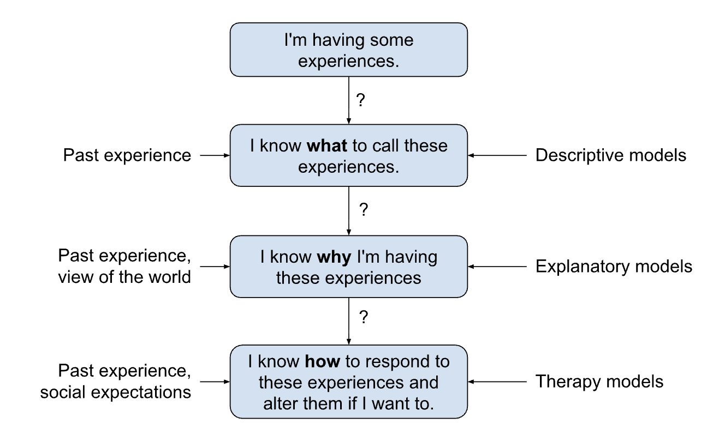
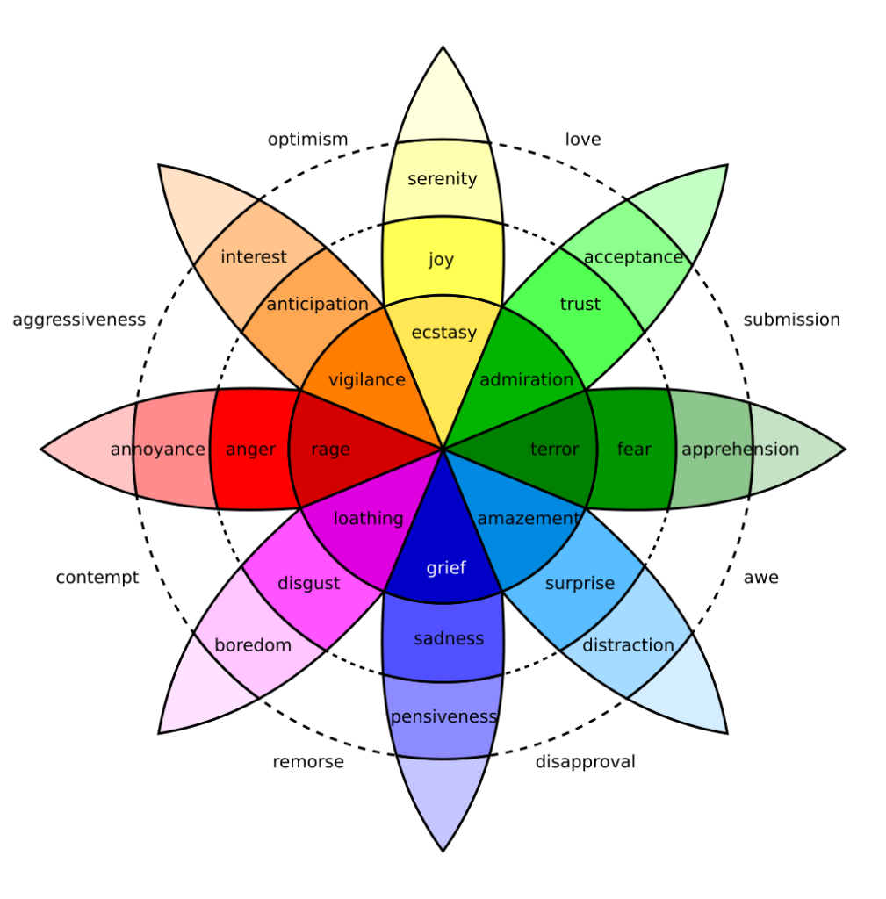
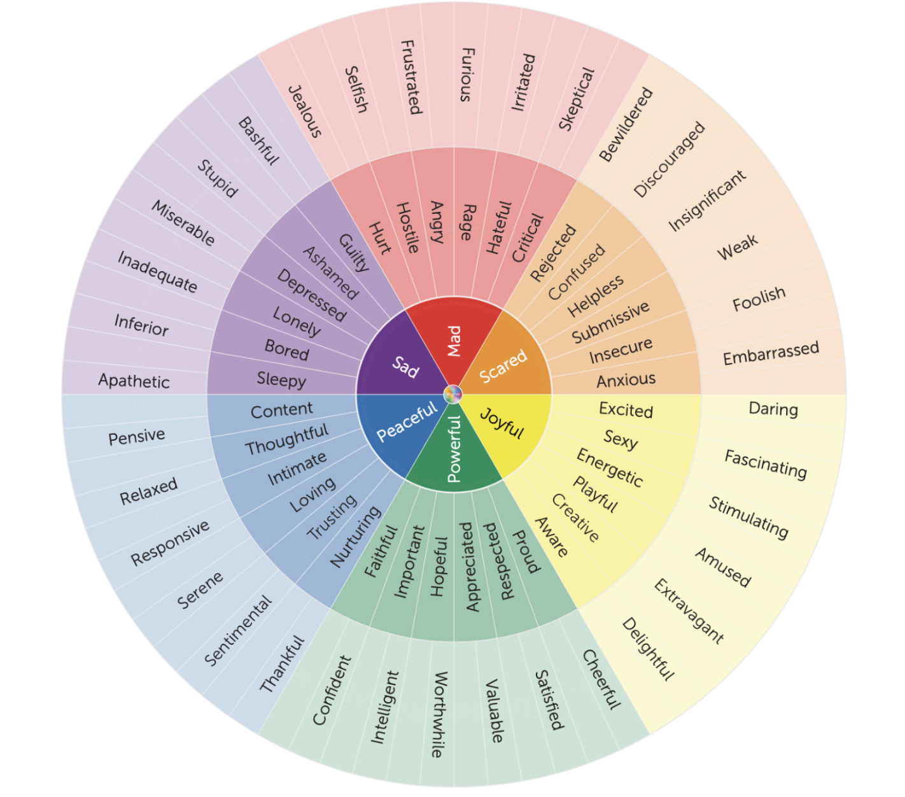
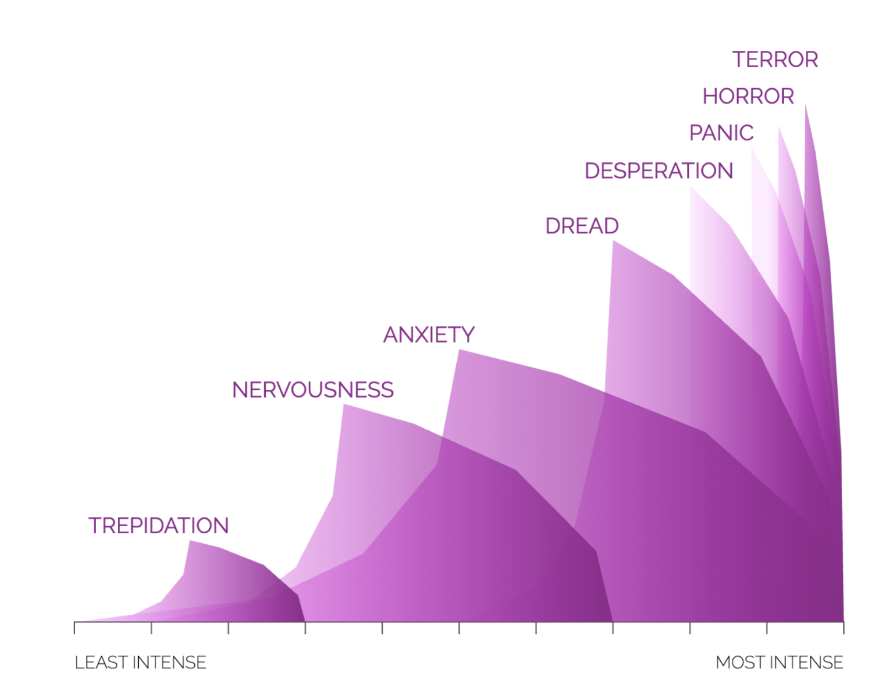
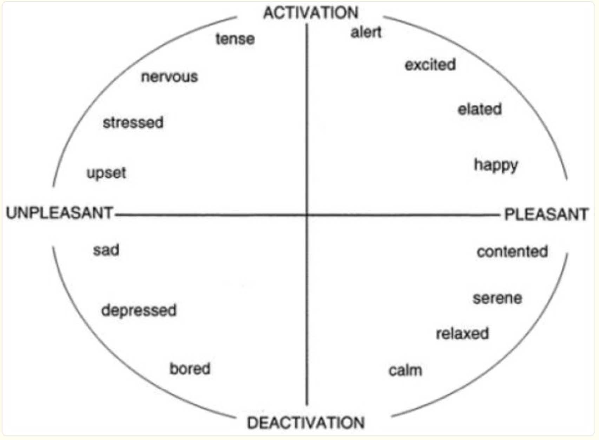
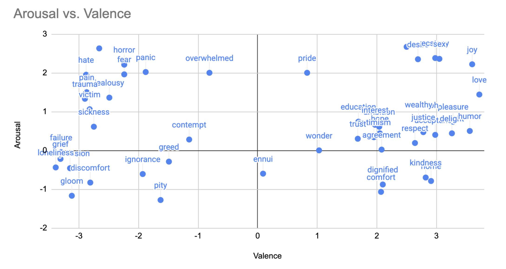
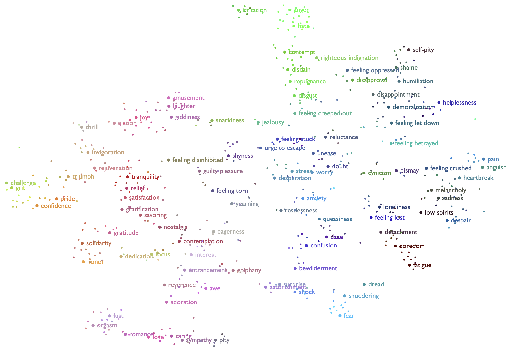
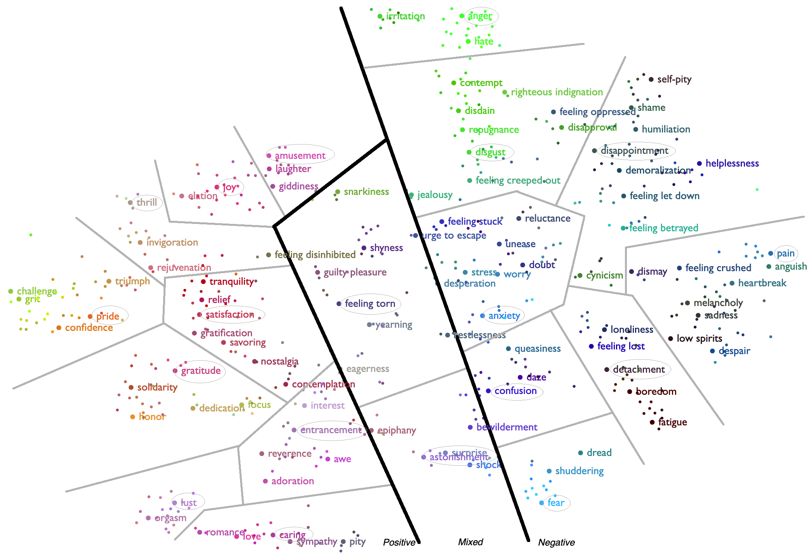

<style>
  table, th, td {
    border: 1px solid #000000;
    border-collapse: collapse;
    padding: 8px;
  }
  th {
    background-color: #f2f2f2;
  }
</style>

# Descriptive Models of Experience

## Overview

This page documents the 'models' section of the Experience Manual JSON files. The purpose of that section is to collect various ways of viewing how experiences relate to each other.

Since experience is a critical part of being human, there have been many great spiritual and philosophical thinkers that have created ways to understand and deal with powerful experiences and unwanted habits. In the past century or so, science has added more ways to understand them.

A 'model of experience' is just a way of understanding what's happening inside. Some models just try to categorize experiences. Others try to explain where experiences come from and how they can be improved. Here's a way to think about what takes place when you have a notable sensation:

Most of the time, we just use past experience and "common sense" to figure out what's happening to us and how to respond. We only think about using religious, philosophical, or scientific models when common sense doesn't seem to be working.



The Experience Manual itself is mainly a descriptive model - aiming to define a larger universe of what's "in there". However, it's recognized that by attempting to define experiences with some level of detail, there's an implicit explanation of what it means to have that experience. And by curating links to external articles, readers are invited to make a choice in altering the experience if desired. 

## Ancient Descriptive Models

People have been grappling with the different human experiences for a long time and around the world. Here are some of the ways have described the inner world:

- Chrysippus, a Greek writer in the 3rd-century BCE, wrote [On Passions](https://en.wikipedia.org/wiki/On_Passions) as a Stoic taxonomy of emotional states. It divides emotions into 4 primary headers and many sub-emotions.
- The Rasa and Bhava Taxonomy from around 200 CE was originally developed as a guide for theater. (Reference: Dancing with Nine Colours: The Nine Emotional States of Indian Rasa Theory; Dyutiman Mukhopadhyay; 2021)
- Buddhist writers compiled the '89 Cittas' within the Abhidhamma, which evolved between 300 BCE and 200 CE (reference: Comprehensive Manual of Abhidhamma translated by Bhikkhu Bodhi)
- Qi Qing - Traditional Chinese Medicine from the 1st century BCE defined a set of seven emotions: Joy, Anger, Anxiety, Grief, Fear, Fright, and Melancholy. (reference: "The Foundations of Chinese Medicine: A Comprehensive Text" by Giovanni Maciocia)

## Modern Descriptive Models

Psychologists have created quite a few models of emotions in their efforts to rationalize modern therapies. Several of these systems are popular and have helped many people put their finger on what they're feeling.

The Experience Manual files include a 'models' array to allow and encourage a more comprehensive view of how one system maps to another.

### Plutchik's Wheel of Emotions

In 1980, Robert Plutchik developed the Wheel of Emotions with a goal of helping people to identify and deal with complex, blended feelings.

Here's a video introduction to the system:

- [Plutchik's Wheel of Emotions](https://www.youtube.com/watch?v=smlw-0av_a0)

This is an image of the wheel from [https://people-shift.com/articles/plutchiks-wheel-of-emotions-a-simple-summary/](https://people-shift.com/articles/plutchiks-wheel-of-emotions-a-simple-summary/):



#### EM Analysis

Pros:
- The simple symmetric pattern is appealing and easy to talk about.
- Not just emotions: 'anticipation' and 'acceptance' are experiences.
- Been around a long time and helps people understand what they're experiencing.

Cons:
- Does not allow for combinations of spokes that are not adjacent to each other.
- The simple symmetry is not always satisfying. e.g. Anger and Fear aren't really 'opposites' and neither are 'Disgust' and 'Trust'.

#### JSON Representation

There are 29 JSON files where the 'models' array contains reference to an experience being part of Plutchik's wheel. Here's how the array is structured for these entries:

```
  "version": "plutchik",
  "entries": [{                 // there can be more than one Plutchik entry per file
      "experience": "remorse",  // EM name
      "modelName": "remorse",   // plutchik name
      "spokes": [ "grief", "loathing" ] // for blends
    },{
      "experience": "sadness", 
      "modelName": "sadness",
      "spokes": ["grief"],
      "stronger": "grief",
      "weaker": "pensiveness"
    }]
```

### Willcox Feelings Wheel

Similar at first glance to the Plutchik Wheel, Gloria Willcox developed her model in the 1980's based on the "Transactional Analysis" psychodynamic school of psychology by Eric Berne from the 1950's. Unfortunately, the specific links to that theoretical basis remain in academic papers behind paywalls. The graphical form of the model remains popular and several versions of it have evolved from the original Willcox wheel.

References

- [https://www.simplypsychology.org/transactional-analysis-eric-berne.html](https://www.simplypsychology.org/transactional-analysis-eric-berne.html)
- [https://www.youtube.com/watch?v=_9W-qHTyZ4o](https://www.youtube.com/watch?v=_9W-qHTyZ4o)

Here's a version of the wheel from [https://allthefeelz.app/feeling-wheel/](https://allthefeelz.app/feeling-wheel/):



And here are some other versions of the wheel:

- [https://www.stardusttherapy.net/printables](https://www.stardusttherapy.net/printables)
- [https://neurodivergentinsights.com/the-feelings-wheel](https://neurodivergentinsights.com/the-feelings-wheel)
- [https://www.gnyha.org/wp-content/uploads/2020/05/The-Feeling-Wheel-Positive-Psycology-Program.pdf](https://www.gnyha.org/wp-content/uploads/2020/05/The-Feeling-Wheel-Positive-Psycology-Program.pdf)
- [https://justallownow.com/blog_files/the-feelings-wheel.html](https://justallownow.com/blog_files/the-feelings-wheel.html)

#### EM Analysis

Pros:

- A simple and appealing symmetric pattern is relatively easy to talk about.
- Not just emotions: 'confident' and 'skeptical' are experiences.
- Covers a fairly wide range of 78 emotions and experiences.
- It's been around a fairly long time and helps people understand what they're experiencing.

Cons:

- The existence of several different versions of this model can be confusing.
- The simple symmetry is not always satisfying. e.g. 'Mad' and 'Powerful' aren't really 'opposites'. The members of the 'Powerful' category indicate this is really 'Healthy Self Regard', which should have the opposite 'Unhealthy Self-Regard'.
- Members of a category don't always make sense. e.g. 'Sleepy' is part of 'Sad'? 'Selfish' is under 'Sad'? 

#### JSON Representation

64 files contain reference to the Willcox Feelings Wheel in the 'models' array.

```
"version": "willcox",
"entries": [{
    "experience": "boredom", // EM name
    "modelName": "bored",    // Willcox name
    "spoke": "sad",
    "parent": "sad"
}]

```

### Ekmans' Atlas of Emotions

Dr. Paul Ekman spent his career studying emotions, so the Dalai Lama asked him to coordinate a scientific consensus of human emotions. Dr. Ekman teamed with his daughter Dr. Eve Ekman and the Stamen Design firm to build a model based on a survey of 248 emotions researchers. The model was released in 2016.

References:

- [https://atlasofemotions.org/](https://atlasofemotions.org/)
- [Youtube: The Atlas of Emotions with Dr. Paul Ekman and Dr. Eve Ekman](https://www.youtube.com/watch?v=AaDzUFL9CLE)

The model is based around 5 collections of emotions envisioned as "continents", with specific emotions portrayed as ever intensifying "mountains". The 5 groups of emotions are Enjoyment, Sadness, Fear, Anger, and disgust. From [the Atlas of Emotions](https://atlasofemotions.org/), here's an example of how they drill into each one. This one is fear:



#### EM Analysis

Pros:

- This model is the most recent and has the broadest scientific support.
- The analogy of 'continents' and 'mountains' is easy to think about.
- The website is attractive, with definitions and a range of responses to each emotion.
- There are links to videos, articles, and websites to help improve emotional awareness and cultivate emotional balance.

Cons:

- The downside of insisting on scientific consensus is that the model is a least-common-denominator. There are fewer 'core' emotions in this model than in many others.
- The desire to collect semi-related experiences together in strict ranking by intensity causes some unsatisfying relationships. For example, does "misery" really make you sadder than "despair"?

#### JSON Representation

29 files contain reference to the Ekman Atlas in the 'models' array. Here's an example entry for the 'anger continent' that contains the "strongest" and "weakest" keywords:

```
"version": "ekmanatlas",
"entries": [{
    "experience": "anger",  // EM name
    "modelName": "anger",   // Ekman name
    "continent": "anger",
    "strongest": "fury",
    "weakest": "annoyance"
}]
```

The rest of the entries create a linked list with the "stronger" and "weaker" keywords:

```
"version": "ekmanatlas",
"entries": [{
    "experience": "frustration",
    "modelName": "frustration",
    "continent": "anger",
    "stronger": "exasperation",
    "weaker": "annoyance"
}]
```

### Circumplex Model

A model called "Pleasure-Arousal-Dominance" (PAD) was developed in 1974 by Albert Mehrabian and James A. Russell. They hypothesized that the underlying structure of the brain had 3 key components that drove emotions:

- "Pleasure": the positivity or negativity of the experience. Also called "valence".
- "Arousal": how much energy/excitement was part of the experience.
- "Dominance": how much agency you felt as part of the experience.

But over the years, it was determined that the Dominance dimension was not independent. James A. Russell tweaked the model by dropping Dominance, creating the 'Circumplex' model.

References
- [https://pmc.ncbi.nlm.nih.gov/articles/PMC2367156/](https://pmc.ncbi.nlm.nih.gov/articles/PMC2367156/)
- [https://pdodds.w3.uvm.edu/research/papers/others/1980/russell1980a.pdf](https://pdodds.w3.uvm.edu/research/papers/others/1980/russell1980a.pdf)

Here's a diagram from the paper:



To give an example how this looks in practice, this is a plot of 49 EM experiences in 2D Valence-Arousal space based on values from [Bradley and Lang](https://pdodds.w3.uvm.edu/teaching/courses/2009-08UVM-300/docs/others/everything/bradley1999a.pdf):



Note: The EM data does not contain valence or arousal numbers.

#### EM Analysis

Pros:

- Gives a theoretical model that matches pretty well with neuroscience. Valence and Arousal are measurable qualities.

Cons:

- A graph like this is not easy to use for putting names on your experiences and improving personal insight into your situation.

#### JSON Representation

The circumplex model is not in the EM data. It would make sense to include valence and arousal data in the data, but the 49 experiences that match the Bradley and Lang data are not complete enough to be very helpful.

### Semantic Space Theory

Alan S. Cowen is a researcher who has helped pioneer the mapping of emotions in 'semantic space'. This is a data science technique where similar emotions are plotted closer together on a graph that's visualized in 2- or 3-dimensions.

The goal of this kind of model is different - instead of helping people understand their own emotions, the aim is to help computers understand people.

References:

- [https://www.alancowen.com/](https://www.alancowen.com)
- [Youtube: Keynote by Alan Cowen | ICML 2022](https://www.youtube.com/watch?v=4-EEhdqETJY)
- [Vocal Call model](https://www.hume.ai/explore/vocal-expression-description-model)

The output of the model is not constrained to simple symmetries - it's a cloud of related experiences. You can draw boundaries around clusters and label them, but for the most part, this approach lets the data speak for itself with the imposition of forced modeling.



For example, you could draw somewhat arbitrary lines around clusters to group similar emotions.



#### EM Analysis

Pros:

- Not constrained by symmetries that may over-simplify the real world.
- More quantitative than most other models.

Cons:

- That openness may make it difficult for the human brain to gain self insight.

#### JSON Representation
None.

### 4D Affective Semantic Space

The Component Process Model of Emotion developed by Klaus Scherer is predominantly and explanatory model, but it hypothesizes that emotions are differentiated by 4 dimensions. This builds on the PAD model by adding "Novelty" as dimension:

- Valence: the positiveness or negativeness of the experience.
- Control/Power: your confidence level in being able to control the experience.
- Arousal/Activation: the intensitity level.
- Novelty/Unpredictability: is this a new feeling or familiar?

References:

- [Emotions are emergent processes: they require a dynamic computational architecture](https://pmc.ncbi.nlm.nih.gov/articles/PMC2781886/)
- [Mapping Emotion Terms into Affective Space: Further Evidence for a Four-Dimensional Structure](https://www.researchgate.net/publication/304184175_Mapping_Emotion_Terms_into_Affective_Space_Further_Evidence_for_a_Four-Dimensional_Structure)

The latter paper has a pair of graphs that plot 80 emotions as points on two 2D axes.

#### EM Analysis

The descriptive piece of this model is a development of PAD and Circumplex, and has an interesting theoretic underpinning with the 5 emotion components of the Component Process Model.

Pros:

- The descriptive portion of the model is well integrated with the explanatory aspect.
- Compared to other models, the operational and measurement aspects are more mature.
- The "Geneva Feelings Wheel" is a practical tool based on the underlying research.

Cons:

- It's difficult to visualize 4 dimensions, so this system may struggle to get popular adoption.


#### JSON Representation

If the source data for the two graphs were found, it would make sense to add a section to the `models` array.

### EM's Model

This is an experimental model that grew alongside the Experience Manual database. It's partly descriptive and partly explanatory.

The core goal is to be able to encompass more scenarios than the more basic models described above. The core observation is that a human is a complex platform built on top of ages-old evolutionary technology. Despite our awesome technology, at the deepest levels, we still embody built-in behavioral instincts that are on display across the living world.

The mind, heart, and gut are complex emotional instruments reacting to constant stimulation from the outside world and your own internal state. There are often multiple concurrent 'tones' experienced by these instruments.

The EM model posits that human experiences take place at 4 levels concurrently:

| Level | Name | Location | Types of Experiences | Example Experiences |
| --- | --- | --- | --- | --- |
| 4 | Rationalizing Person | Consciousness | Things that as far as we know, only a human can experience. | modesty, nostalgia, irony |
| 3 | Tribal Primate | Subconcious | Things a chimp can likely experience | desire for social status, resentment |
| 2 | Family Creature | Heart | Things a cat can likely experience. | desire for parenthood, shame, familial love |
| 1 | Surviving Animal | Gut | Things a fish can likely experience. | anxiety, satisfaction, hunger |

For example, there's a variation of "acceptance" called "unhappy acceptance". It's a form of partial acceptance where part of the self has stopped fighting, but another part is not at peace yet. Here is how the EM model tries to capture this nuance:

- Level 1 is still ultimately dissatisfied, feeling dissatisfaction or dissonance
- Level 2 feels resentment or sadness
- Levels 4 and 3 are trying to move on, but experience the underlying dissonance as  "Unhappy Acceptance"

The EM model also proposes that there are different types of experiences:

| Type | Scenario | Examples |
| --- | --- | --- |
| Sensations | Reactive experiences, where you perceive something happened to you. | happiness, tiredness |
| Impulses | A desire to cling onto something or change the situation. | helpfulness (I want to help), envy (I wish I had that) |
| Agency/Action | The experience of actually affecting the world somehow. These are things you can be aware of doing as you're doing them. | sacrifice, prayer, problem solving |
| Capacities | Actions you are generally not aware that you're doing. | attention, confirmation |
| Nodes | A few experience labels are so varied in common usage that it's hard to define it in a useful way. 'Nodes' point to more specific experiences. | love, hate, pride |
| Patterns | Personality traits that lead one to have certain experiences over and over. | gloom, joy |

In the real world, experiences are a mix of types. For instance, when you experience shame, there are sensations like "anxiety","fear", and "loss of status". But there are also impulses like "desire to regain social status", "desire to be left alone", etc.

#### EM Analysis

Pros:

- This model doesn't try to find hidden computational dimensions. Instead, it hypothesizes what may be happening at each level of the self when we label an experiance.
- Thinking about experiences as multi-leveled may be helpful in sorting through a complex reaction.
- The model 'homes' experiences to different places within the body. This may help describe emotions when we use phrases like "gut feeling" and "from the heart".

Cons:

- This model is not backed by professional emotions researchers.
- It is still under development.

#### JSON Representation

```
"version": "em1",
"entries": [{
       ...
       },{
            "names": ["unhappy acceptance"],
            "predominantType": "impulse",
            "levels": {
              "4,3": {
                "experiences": ["unhappy acceptance"]
              },
              "2": {
                "experiences": ["resentment","sadness"]
              },
              "1": {
                "experiences": ["dissatisfaction","dissonance"]
              }
            }
```

## Conclusion

The 'models' section of the EM JSON files is a way to provide broader context to each experience. Applications might use these fields as a way to organize and link entries to help people navigate and discover what's going on inside.
